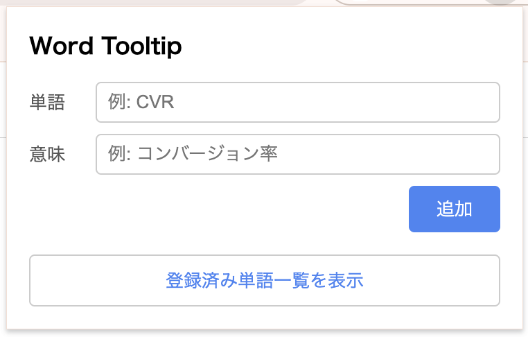
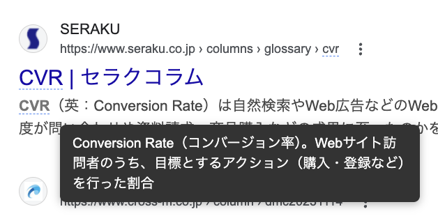

# Word Tooltip

Webページ上の単語にマウスを乗せると、事前に登録した意味をツールチップで表示するChrome拡張機能です。

## スクリーンショット

| 単語の登録 | ツールチップ表示 |
|:---:|:---:|
|  |  |

## 機能

- 単語と意味をセットで登録
- ページ内の登録済み単語を自動でハイライト（大文字小文字を区別しない）
- ホバーで意味をツールチップ表示
- 登録済み単語の一覧表示・編集・削除
- 動的に読み込まれるコンテンツにも対応

## インストール

1. このリポジトリをクローンまたはダウンロード
2. Chromeで `chrome://extensions` を開く
3. 「デベロッパーモード」をONにする
4. 「パッケージ化されていない拡張機能を読み込む」からこのフォルダを選択
